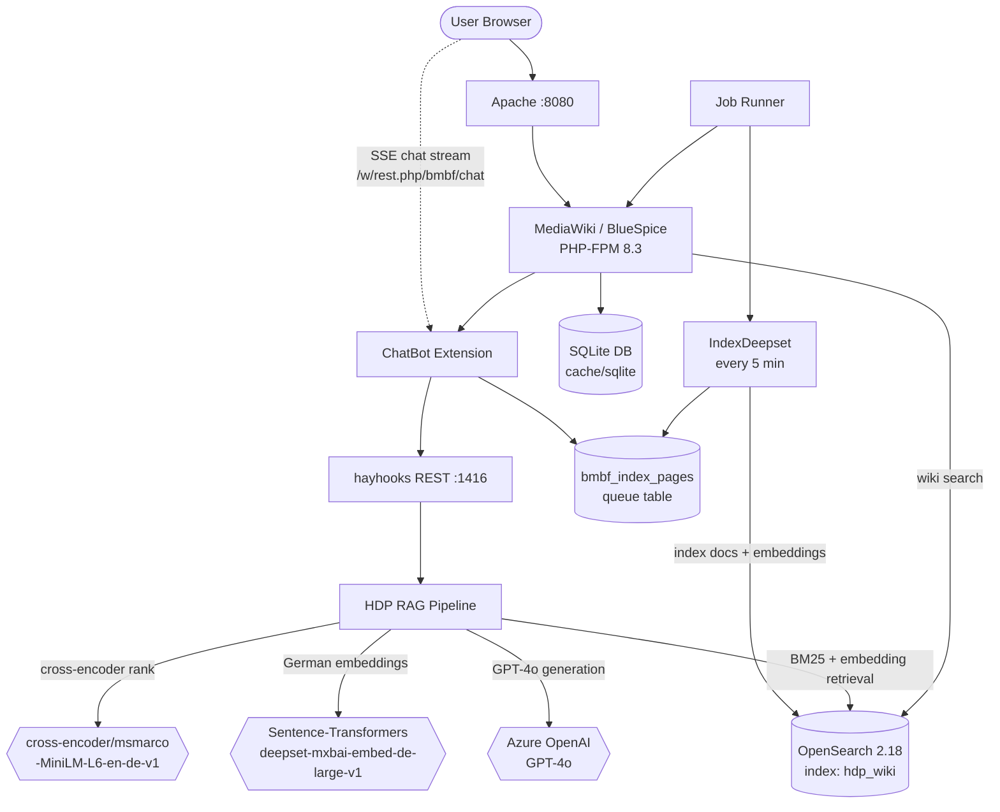

# Architecture

BlueSpice HDP is a containerized enterprise wiki with an integrated AI chatbot. The core is a standard MediaWiki 1.43 + BlueSpice Pro deployment running on PHP-FPM 8.3, augmented by a Haystack-based RAG pipeline that provides natural-language question answering over wiki content. Five Docker services work together: the wiki application, a web server, a job runner, an OpenSearch search engine, and the Haystack pipeline server.

Data flows in two main paths. The **content path** starts when editors create or modify wiki pages — the ChatBot extension hooks into BlueSpice ExtendedSearch's update lifecycle, queuing page content (text, metadata, sections) into a `bmbf_index_pages` database table. A periodic job (every 5 minutes) pushes queued documents into the OpenSearch `hdp_wiki` index with embeddings generated by `mixedbread-ai/deepset-mxbai-embed-de-large-v1`. The **query path** starts when a user asks a question in the chat UI — the browser calls MediaWiki REST endpoints (`/bmbf/chat`), which proxy to the Haystack hayhooks API. The pipeline reformulates the query using chat history, performs hybrid retrieval (BM25 + embedding) from OpenSearch, re-ranks with a German cross-encoder, and generates an answer via Azure OpenAI GPT-4o using a strict grounded-answer prompt.

## Components

- **MediaWiki / BlueSpice (PHP-FPM)** — The wiki application server running MediaWiki 1.43 with ~130 BlueSpice and third-party extensions. See [`modules/settings-d.md`](modules/settings-d.md).
- **Apache Web Server** — Reverse proxy serving HTTP on port 8080, forwarding to PHP-FPM.
- **MediaWiki Job Runner** — Background worker processing MediaWiki jobs (indexing, notifications, deferred tasks).
- **OpenSearch 2.18** — Dual-purpose search engine: powers BlueSpice ExtendedSearch (wiki search UI) and serves as the RAG vector store (index `hdp_wiki`, 1024-dim cosine embeddings). See [`modules/extended-search.md`](modules/extended-search.md).
- **Haystack / hayhooks** — The RAG pipeline server. Loads `hdp_pipeline.yaml`, exposes a REST API on port 1416. See [`modules/haystack-pipeline.md`](modules/haystack-pipeline.md).
- **ChatBot Extension** — MediaWiki extension bridging the chat UI to Haystack. Provides REST endpoints, SSE streaming, feedback collection, PDF export, and the wiki→OpenSearch indexing pipeline. See [`modules/chatbot.md`](modules/chatbot.md).

## System Diagram

## Data Flow

### Content Indexing (wiki → OpenSearch)

1. **Page edit/save** — Editor modifies a wiki page; MediaWiki fires `BSExtendedSearchUpdateJob` — [`app/extensions/ChatBot/src/ExternalIndex/UpdateIndexTable.php`](../app/extensions/ChatBot/src/ExternalIndex/UpdateIndexTable.php)
2. **Queue insertion** — `UpdateIndexTable::doPush()` inserts a record into `bmbf_index_pages` table with action (update/delete) and page data — same file
3. **Periodic indexing** — `IndexDeepset` run-jobs trigger (every 5 minutes) reads queued records, renders page content, extracts metadata (title levels, sections, categories, chatbotmeta tags), and pushes to OpenSearch via Deepset Index API — [`app/extensions/ChatBot/src/RunJobsTriggerHandler/IndexDeepset.php`](../app/extensions/ChatBot/src/RunJobsTriggerHandler/IndexDeepset.php)

### Chat Query (user → answer)

1. **User asks question** — Browser chat widget sends GET to `/w/rest.php/bmbf/chat?query=...&sessionId=...&followUpType=rag` — [`app/extensions/ChatBot/src/Rest/Chat.php`](../app/extensions/ChatBot/src/Rest/Chat.php)
2. **Proxy to Haystack** — `ChatApi::request()` sends SSE streaming request to hayhooks `/hdp_pipeline/chat-stream` with query, session, and routing path — [`app/extensions/ChatBot/src/DeepsetApi/ChatApi.php`](../app/extensions/ChatBot/src/DeepsetApi/ChatApi.php)
3. **Query reformulation** — Pipeline's `chat_summary_prompt_builder` + `chat_summary_llm` (GPT-4o) reformulate the query using chat history — [`docker/haystack/hdp_pipeline.yaml`](../docker/haystack/hdp_pipeline.yaml) lines 49–59, 214–218
4. **Hybrid retrieval** — BM25 retriever (top 30) + embedding retriever (top 40) query OpenSearch in parallel; results joined via `DocumentJoiner` — same YAML, lines 81–127, 228–233
5. **Cross-encoder ranking** — `SentenceTransformersSimilarityRanker` (German bi-encoder) re-ranks to top 14, embedding metadata fields — same YAML, lines 129–137
6. **Prompt assembly** — `ConditionalRouter` selects answer mode (rag/followup_short/followup_elaborate/followup_bulletpoints/followup_onlytext/followup_citations); selected prompt builder formats documents with strict German grounded-answer instructions — same YAML, lines 165–192, 237–255
7. **LLM generation** — `answerllm` (Azure OpenAI GPT-4o, temperature 0) generates answer; response streamed back as SSE — same YAML, lines 155–163, 256–255

## Key Design Decisions

- **SQLite as default DB** — The Docker setup uses SQLite (`cache/sqlite/`) for zero-config startup. Production deployments can switch to MariaDB/MySQL via `MW_DBTYPE`.
- **Dual OpenSearch role** — OpenSearch serves both BlueSpice ExtendedSearch (wiki search UI) and the Haystack RAG vector store (index `hdp_wiki`). The `hdp_wiki` index uses 1024-dimensional cosine similarity embeddings.
- **German-first NLP models** — Embedding model (`deepset-mxbai-embed-de-large-v1`) is specifically chosen for German-language content; the cross-encoder ranker (`cross-encoder/msmarco-MiniLM-L6-en-de-v1`) is cross-lingual EN-DE, covering the wiki's mixed English/German pages.
- **Six answer modes** — The `ConditionalRouter` supports six response styles: `rag` (default detailed), `followup_short`, `followup_elaborate`, `followup_bulletpoints`, `followup_onlytext`, `followup_citations`. Each routes to a different prompt template.
- **SSE streaming** — Chat responses use Server-Sent Events for real-time token streaming from Haystack through MediaWiki to the browser, avoiding buffering.
- **Indexed async pipeline** — Wiki content isn't indexed synchronously on edit; instead it's queued in `bmbf_index_pages` and processed every 5 minutes by a background job, decoupling edit latency from indexing.
- **Configurable LLM backend** — The pipeline YAML uses environment variables for Azure OpenAI credentials, allowing different deployments to point at different LLM endpoints without code changes.
