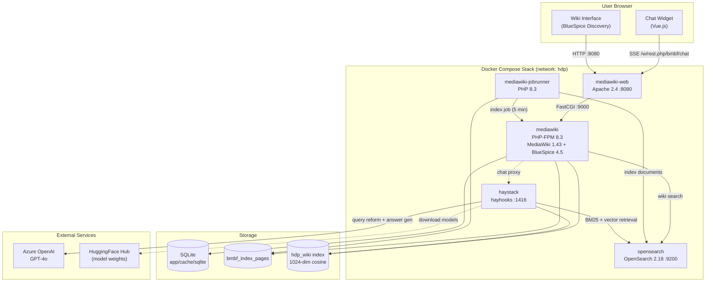
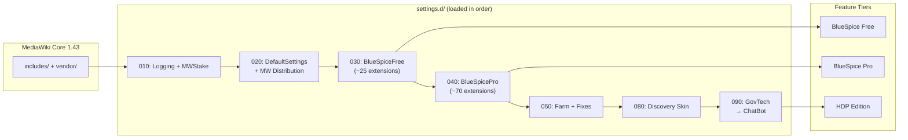
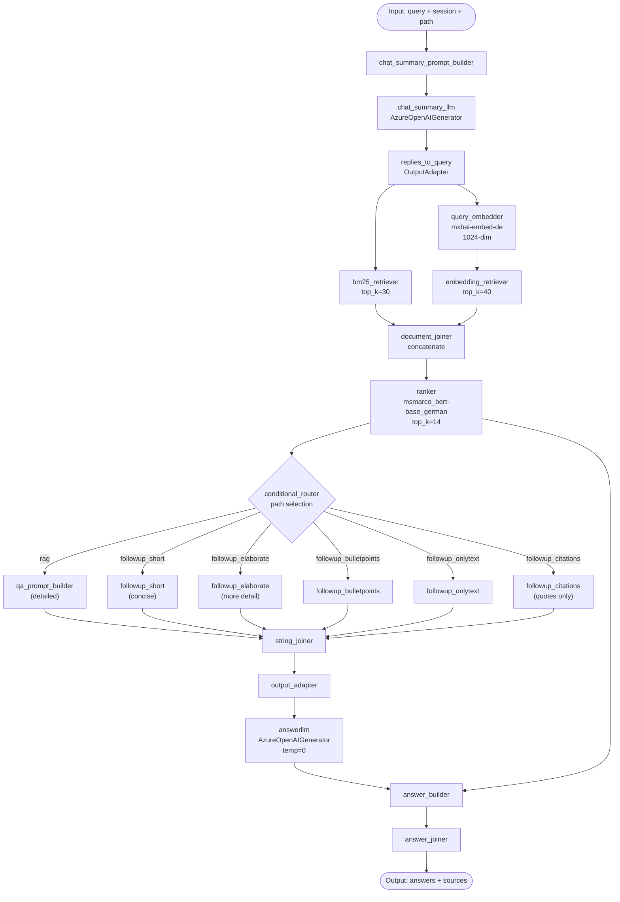

# Architecture Diagrams

## System Architecture (Service Topology)

High-level view of all services, their ports, and data flow directions.

## Extension Loading Order

How `settings.d/` files map to feature tiers.

## RAG Pipeline Internal Flow

The Haystack pipeline's component graph.

