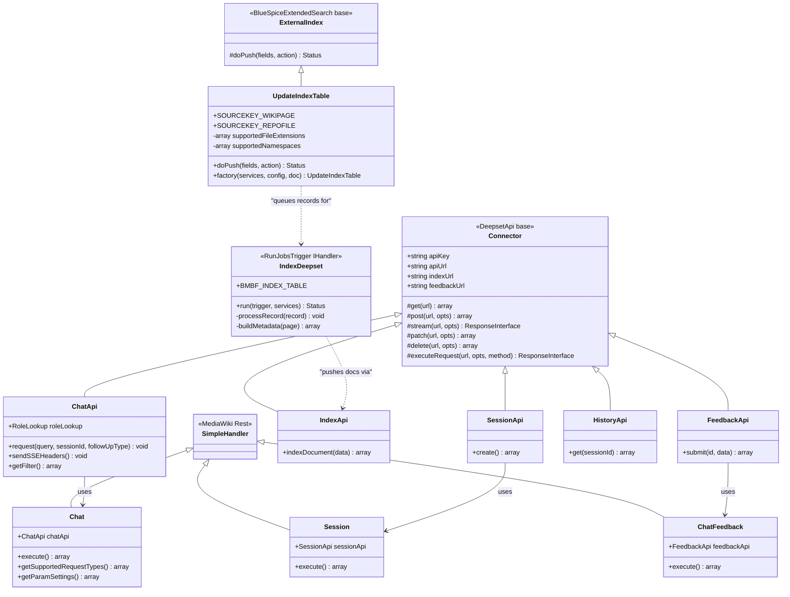

# Class Diagram: ChatBot Extension

Core classes in the ChatBot extension showing inheritance, composition, and service relationships.

## Notes

- **`Connector`** is the base HTTP client for all Deepset API communication. It wraps Guzzle with Bearer token auth, 120s timeout, and JSON parsing.
- **`ChatApi`** extends `Connector` with SSE streaming support (`stream()` method) and role-based document filtering (`getFilter()`).
- **`UpdateIndexTable`** extends BlueSpice ExtendedSearch's `ExternalIndex` base class — this is the integration point where ChatBot hooks into the wiki's search indexing pipeline.
- **`IndexDeepset`** implements MWStake's `IHandler` interface for periodic job execution. It consumes records from `bmbf_index_pages` and pushes them to OpenSearch via `IndexApi`.
- **REST handlers** all extend MediaWiki's `SimpleHandler` and receive their API service via dependency injection (ServiceWiring).
