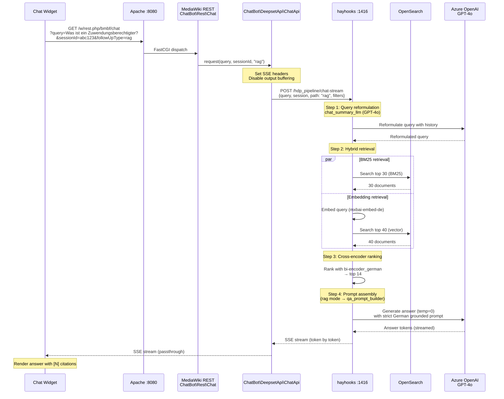
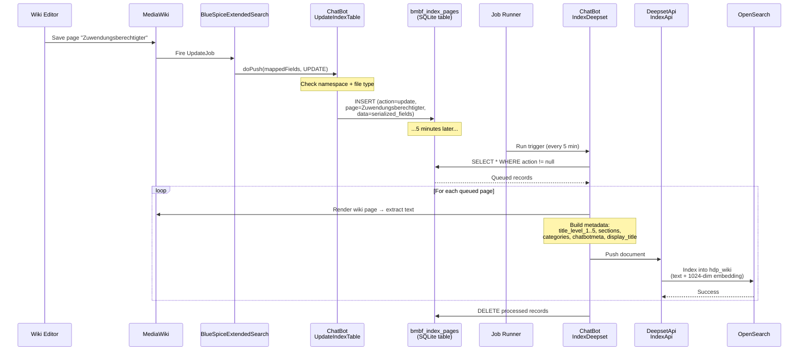
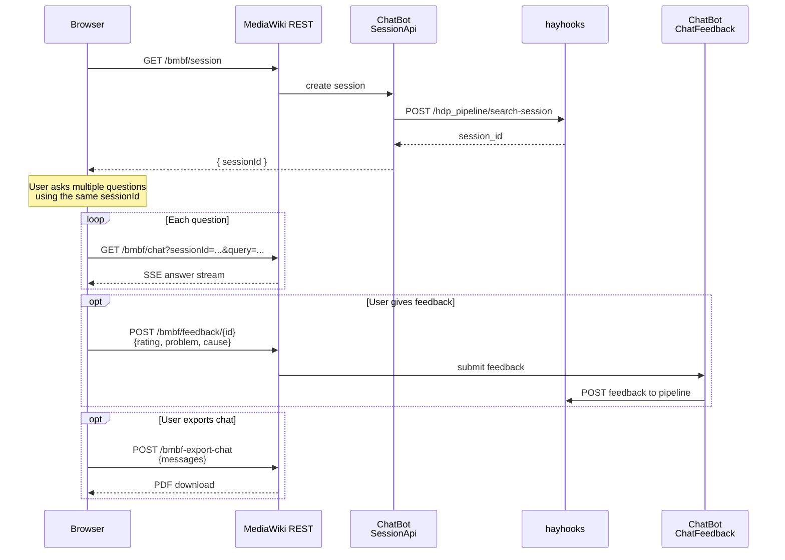

# Sequence Diagrams

## Workflow: Chat Query (User → RAG Answer)

The primary user-facing workflow: a user asks a question in the chat widget and receives a grounded, source-cited answer streamed in real-time.

### Walkthrough

1. **User input** — Browser chat widget sends GET with query, session ID, and answer mode
2. **SSE setup** — `ChatApi::sendSSEHeaders()` sets `Content-Type: text/event-stream`, disables buffering
3. **Pipeline execution** — hayhooks runs the deployed `hdp_pipeline` with the provided parameters
4. **Query reformulation** — GPT-4o rewrites the query incorporating chat history
5. **Hybrid retrieval** — BM25 (top 30) + embedding (top 40) from OpenSearch `hdp_wiki` index in parallel
6. **Cross-encoder ranking** — German bi-encoder model re-ranks to top 14 most relevant documents
7. **Answer generation** — GPT-4o generates grounded answer with `[N]` citation format, streamed via SSE

---

## Workflow: Wiki Content Indexing (Edit → OpenSearch)

When an editor saves a wiki page, the content is asynchronously indexed into OpenSearch for RAG retrieval. This is decoupled via a queue table and a 5-minute background job.

### Walkthrough

1. **Page save** — Editor saves a page; ExtendedSearch fires an update job
2. **Queue insertion** — ChatBot's `UpdateIndexTable` (registered as ExtendedSearch `ExternalIndex`) intercepts the update and inserts a record into `bmbf_index_pages` with the action type and page data
3. **Background processing** — Every 5 minutes, the `IndexDeepset` run-jobs trigger reads queued records
4. **Content rendering** — For each page, the handler renders the wiki content, extracts section hierarchy (`title_level_1` through `title_level_5`), and builds metadata (categories, sections, chatbotmeta tags, display title)
5. **Indexing** — Documents are pushed to OpenSearch's `hdp_wiki` index with both text and 1024-dimensional embeddings
6. **Cleanup** — Processed records are deleted from the queue table

---

## Workflow: Chat Session Lifecycle

How a chat session is created, used, and optionally exported.

