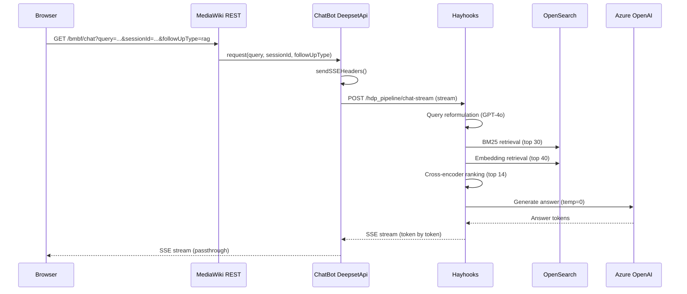

# Module: ChatBot Extension

The ChatBot extension (`app/extensions/ChatBot/`) is the HDP-specific component that bridges the MediaWiki wiki to the Haystack RAG pipeline. It provides the chat UI, REST API endpoints for chat/session/history/feedback, the Deepset API connector for proxying to hayhooks, the wiki-content indexing pipeline, and admin tools for feedback management.

## Responsibilities

- **Chat UI** — Vue.js chat widget (`resources/js/`) with SSE streaming, six answer modes, session management
- **REST API** — MediaWiki REST endpoints under `/bmbf/*` for chat, sessions, history, feedback, and exports
- **Deepset API Connector** — HTTP client proxying requests to the Haystack/hayhooks pipeline
- **Content Indexing** — Hooks into BlueSpice ExtendedSearch to queue wiki content for the OpenSearch `hdp_wiki` index
- **Feedback & Admin** — Collects user feedback on answers, provides admin stats dashboard
- **PDF/ODF Export** — Exports chat histories as PDF or ODF documents

## Key Files

- [`extension.json`](../../app/extensions/ChatBot/extension.json) — Extension manifest: REST routes, hooks, config definitions, namespaces, resource modules
- [`includes/ServiceWiring.php`](../../app/extensions/ChatBot/includes/ServiceWiring.php) — DI container definitions for all Deepset API services
- [`src/DeepsetApi/Connector.php`](../../app/extensions/ChatBot/src/DeepsetApi/Connector.php) — Base HTTP client for Deepset/hayhooks API (GET/POST/PATCH/DELETE/stream)
- [`src/DeepsetApi/ChatApi.php`](../../app/extensions/ChatBot/src/DeepsetApi/ChatApi.php) — Chat request handler: sends SSE streaming requests to hayhooks `/chat-stream`
- [`src/Rest/Chat.php`](../../app/extensions/ChatBot/src/Rest/Chat.php) — REST handler for `GET /bmbf/chat` (SSE endpoint)
- [`src/Rest/Session.php`](../../app/extensions/ChatBot/src/Rest/Session.php) — REST handler for creating chat sessions
- [`src/Rest/History.php`](../../app/extensions/ChatBot/src/Rest/History.php) — REST handler for chat history
- [`src/Rest/ChatFeedback.php`](../../app/extensions/ChatBot/src/Rest/ChatFeedback.php) — REST handler for answer feedback
- [`src/ExternalIndex/UpdateIndexTable.php`](../../app/extensions/ChatBot/src/ExternalIndex/UpdateIndexTable.php) — Hooks into ExtendedSearch updates; queues content in `bmbf_index_pages` table
- [`src/RunJobsTriggerHandler/IndexDeepset.php`](../../app/extensions/ChatBot/src/RunJobsTriggerHandler/IndexDeepset.php) — Background job (every 5 min): reads queue, renders pages, pushes to Deepset Index API
- [`src/PdfExport/`](../../app/extensions/ChatBot/src/PdfExport/) — PDF export integration with PDFCreator extension

## Public API

### REST Endpoints (defined in `extension.json`)

| Method | Path | Handler | Purpose |
|---|---|---|---|
| GET | `/bmbf/chat` | `ChatBot\Rest\Chat` | SSE streaming chat (text/event-stream) |
| GET | `/bmbf/session` | `ChatBot\Rest\Session` | Create new chat session |
| POST | `/bmbf/history` | `ChatBot\Rest\History` | Retrieve chat history |
| POST | `/bmbf/feedback/{id}` | `ChatBot\Rest\ChatFeedback` | Submit answer feedback |
| POST | `/bmbf-feedback-mail/{id}` | `ChatBot\Rest\SendFeedbackMail` | Send feedback email |
| POST | `/bmbf-export-chat` | `ChatBot\Rest\CreateChatPdf` | Export chat as PDF |
| POST | `/bmbf-odf-export-chat` | `ChatBot\Rest\CreateChatOdf` | Export chat as ODF |

### Configuration Variables (MediaWiki `$wg` globals)

- `$wgBmbfDeepsetApiChatUrl` — Hayhooks pipeline URL for chat (e.g., `http://haystack:1416/hdp_pipeline`)
- `$wgBmbfDeepsetApiIndexUrl` — Deepset indexing API URL
- `$wgBmbfDeepsetApiSearchSessionsUrl` — Session creation API URL
- `$wgBmbfDeepsetApiFeedbackUrl` — Feedback submission API URL
- `$wgBmbfDeepsetApiKey` — API key for Deepset authentication
- `$wgBmbfDeepsetIndexSupportedFileExtensions` — File types to index: `txt, csv, json, xml, html, md, pdf, docx, pptx, xlsx`

### Namespaces

- `NS_BMBF` (5000) — "Ministerium" (Ministry content namespace)
- `NS_PT` (5002) — "Projektträger" (Project sponsor namespace)

## Internal Structure

```
ChatBot/
├── extension.json          # Manifest: routes, hooks, config, namespaces
├── includes/
│   └── ServiceWiring.php   # DI definitions for Deepset API services
├── src/
│   ├── DeepsetApi/         # HTTP clients for hayhooks/Deepset
│   │   ├── Connector.php   # Base: GET/POST/PATCH/DELETE/stream
│   │   ├── ChatApi.php     # Chat with SSE streaming
│   │   ├── SessionApi.php  # Session management
│   │   ├── IndexApi.php    # Document indexing
│   │   ├── FeedbackApi.php # Feedback submission
│   │   └── HistoryApi.php  # Chat history retrieval
│   ├── Rest/               # MediaWiki REST handlers
│   ├── ExternalIndex/      # ExtendedSearch hook integration
│   ├── RunJobsTriggerHandler/  # Background indexing job
│   ├── Hook/               # Permission and hook handlers
│   ├── Model/              # ChatMessage model + factory
│   ├── PdfExport/          # PDF/ODF export modules
│   └── Util/               # Role lookup utilities
├── resources/
│   ├── js/                 # Vue.js chat widget (webpack bundle)
│   └── styles/             # LESS stylesheets
├── i18n/                   # Internationalization (de, en, qqq)
├── data/                   # Content provisioning data
└── db/
    └── bmbf_index_pages.sql  # Index queue table schema
```

## Chat Request Flow



## Dependencies

- **Uses:** BlueSpiceFoundation (config, services), BlueSpiceExtendedSearch (ExternalIndex hook), PDFCreator (export), MWStake RunJobsTrigger (background jobs), GuzzleHttp (HTTP client)
- **Used by:** Nothing (top-level extension, consumed by the browser chat widget)
- **Requires:** Haystack/hayhooks pipeline running and accessible via `$wgBmbfDeepsetApiChatUrl`

## Notable Patterns / Gotchas

- **SSE streaming bypass** — `ChatApi::request()` sets `Content-Type: text/event-stream` headers and disables output buffering (`ob_end_flush`) before proxying the hayhooks stream. This is necessary because standard MediaWiki output buffering would break SSE.
- **Deepset naming** — Despite the name "DeepsetApi", this connector talks to the local hayhooks instance (or deepset Cloud). The class names (`DeepsetApi\Connector`, `DeepsetChatApi`) are historical — they work with any OpenAI-compatible/hayhooks endpoint.
- **Role-based filtering** — `ChatApi::getFilter()` builds OpenSearch filters based on the user's role assignments (`RoleLookup`), enabling document-level access control in RAG results.
- **Index queue pattern** — Wiki edits don't immediately index to OpenSearch. Instead, `UpdateIndexTable` inserts into `bmbf_index_pages`, and `IndexDeepset` processes the queue every 5 minutes. This decouples edit latency from indexing overhead.
- **Six answer modes** — `followUpType` parameter maps to the pipeline's `ConditionalRouter` paths: `rag`, `followup_short`, `followup_elaborate`, `followup_bulletpoints`, `followup_onlytext`, `followup_citations`.
