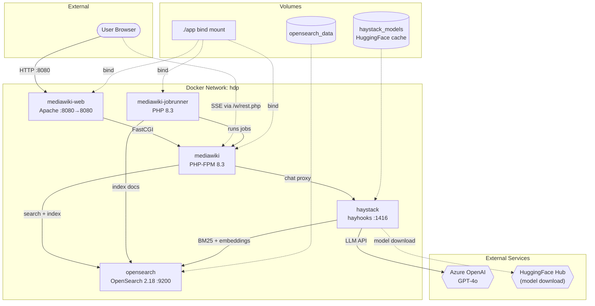

# Module: Docker Services

The Docker setup consists of two compose files and supporting build files. The root `docker-compose.yml` is the production/dev stack (5 services), while `app/docker-compose.yml` is the original Wikimedia dev image stack (3 services, no RAG). Custom Docker support files live in `docker/`.

## Responsibilities

- Orchestrate five containers: MediaWiki (PHP-FPM), Apache, JobRunner, OpenSearch, Haystack
- Build the Haystack image with CPU or GPU PyTorch
- Manage persistent volumes for OpenSearch data and HuggingFace model cache
- Configure inter-service networking and health checks

## Key Files

- [`docker-compose.yml`](../../docker-compose.yml) — Main compose file (root): 5 services + 2 volumes + 1 network
- [`app/docker-compose.yml`](../../app/docker-compose.yml) — Original repo compose (Wikimedia dev images, 3 services only)
- [`docker/haystack/Dockerfile`](../../docker/haystack/Dockerfile) — Multi-stage Haystack build
- [`docker/haystack/entrypoint.sh`](../../docker/haystack/entrypoint.sh) — Haystack startup script
- [`docker/haystack/hdp_pipeline.yaml`](../../docker/haystack/hdp_pipeline.yaml) — RAG pipeline (copied into image)
- [`docker/wiki/`](../../docker/wiki/) — Legacy custom MediaWiki Dockerfiles (no longer used with Wikimedia images)
- [`.env.example`](../../.env.example) — Environment variable template

## Service Topology

## Service Details

### mediawiki (PHP-FPM)
- **Image:** `docker-registry.wikimedia.org/dev/bookworm-php83-fpm:1.0.0`
- **Volumes:** `./app:/var/www/html/w` (bind mount, shared with web + jobrunner)
- **Database:** SQLite at `/var/www/html/w/cache/sqlite`
- **Depends on:** OpenSearch (healthy)

### mediawiki-web (Apache)
- **Image:** `docker-registry.wikimedia.org/dev/bookworm-apache2:1.0.1`
- **Ports:** `${MW_DOCKER_PORT:-8080}:8080`
- **Role:** Reverse proxy, serves static assets, forwards PHP to FPM

### mediawiki-jobrunner
- **Image:** `docker-registry.wikimedia.org/dev/bookworm-php83-jobrunner:1.0.0`
- **Role:** Continuously runs MediaWiki jobs (indexing, notifications, ChatBot's 5-min indexing cycle)

### opensearch
- **Image:** `opensearchproject/opensearch:2.18.0`
- **Config:** Single-node, 512MB JVM heap, security disabled certs
- **Credentials:** admin / `Hdp-Search-2024!` (hardcoded in compose)
- **Index:** `hdp_wiki` (1024-dim cosine, for RAG) + BlueSpice ExtendedSearch indices
- **Health check:** `curl -sk https://localhost:9200/_cluster/health`

### haystack
- **Build:** `docker/haystack/Dockerfile` (multi-stage: Python 3.11 + PyTorch + haystack-ai 2.10.0)
- **Ports:** `${HAYHOOKS_PORT:-1416}:1416`
- **Volumes:** `haystack_models:/root/.cache/huggingface` (cached model weights)
- **Depends on:** OpenSearch (healthy)
- **Env vars:** `OPENSEARCH_URL`, `LLM_API_KEY`, `LLM_BASE_URL`, `LLM_MODEL`, `EMBEDDING_MODEL`, `HAYSTACK_DEVICE`

## Notable Patterns / Gotchas

- **Shared bind mount** — All three MediaWiki containers (FPM, web, jobrunner) mount `./app` at `/var/www/html/w`. This means code changes are immediately visible without rebuilding images.
- **SQLite in bind mount** — The database lives at `app/cache/sqlite/`, inside the bind mount. This makes it easy to inspect but means the DB file is shared across all three containers (potential write contention in high-load scenarios).
- **Two compose files** — `docker-compose.yml` (root) is the full HDP stack. `app/docker-compose.yml` is the original Wikimedia dev setup without OpenSearch/Haystack. Only the root file should be used for HDP.
- **Hardcoded OpenSearch password** — The compose file hardcodes `Hdp-Search-2024!` as the OpenSearch admin password. The `.env.example` defines `OPENSEARCH_ADMIN_PASS` but it's not wired into the compose file.
- **Legacy docker/wiki/ files** — `docker/wiki/` contains old custom Dockerfiles (`Dockerfile`, `LocalSettings.php.template`, `entrypoint.sh`, etc.) from a previous custom-image approach. These are no longer used since the switch to Wikimedia dev images.
- **GPU mode** — Set `HAYSTACK_DEVICE=gpu` in `.env` before building. This selects the `deps-gpu` Docker stage with CUDA PyTorch (~8GB image vs ~2GB CPU image).
