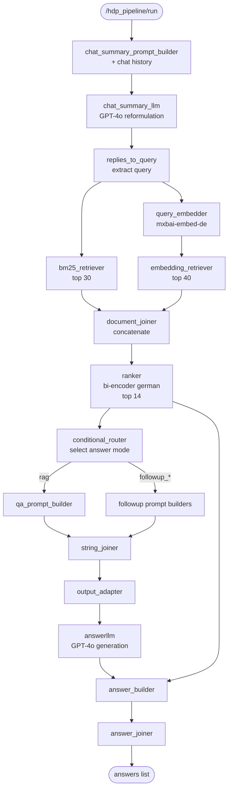

# Module: Haystack RAG Pipeline

The Haystack RAG pipeline performs retrieval-augmented generation over wiki content. It is defined as a YAML pipeline file deployed via hayhooks (the Haystack REST server). A Python equivalent exists in `pipeline/haystack-pipeline.py` for reference and local testing.

## Responsibilities

- **Query reformulation** — Rewrite the user query using chat history for better retrieval
- **Hybrid retrieval** — Parallel BM25 + dense embedding retrieval from OpenSearch
- **Cross-encoder ranking** — Re-rank retrieved documents using a German bi-encoder model
- **Multi-mode generation** — Six answer styles controlled by a conditional router
- **Grounded answer generation** — Strict prompts forcing the LLM to cite sources as `[N]` references

## Key Files

- [`docker/haystack/hdp_pipeline.yaml`](../../docker/haystack/hdp_pipeline.yaml) — Production pipeline definition (286 lines), deployed by hayhooks
- [`docker/haystack/Dockerfile`](../../docker/haystack/Dockerfile) — Multi-stage build: Python 3.11 + PyTorch (CPU/GPU) + haystack-ai 2.10.0
- [`docker/haystack/entrypoint.sh`](../../docker/haystack/entrypoint.sh) — Startup script: waits for OpenSearch, pre-downloads models, starts hayhooks, deploys pipeline
- [`pipeline/haystack-pipeline.py`](../../pipeline/haystack-pipeline.py) — Python pipeline definition (372 lines, equivalent to YAML, for local testing)

## Pipeline Components

| Component | Type | Purpose |
|---|---|---|
| `chat_summary_prompt_builder` | `PromptBuilder` | Reformulates query using chat history |
| `chat_summary_llm` | `OpenAIGenerator` | LLM for query reformulation (temp=0), any OpenAI-compatible endpoint via `HDP_LLM_BASE_URL` |
| `replies_to_query` | `OutputAdapter` | Extracts reformulated query from LLM reply |
| `bm25_retriever` | `OpenSearchBM25Retriever` | Lexical search, top 30 |
| `query_embedder` | `SentenceTransformersTextEmbedder` or `OpenAITextEmbedder` | Embeds query. **Swappable** via `HDP_EMBEDDING_PROVIDER` — see [docs/embedding-providers.md](../embedding-providers.md) |
| `embedding_retriever` | `OpenSearchEmbeddingRetriever` | Dense search, top 40, efficient filtering |
| `document_joiner` | `DocumentJoiner` | Merges BM25 + embedding results (concatenate) |
| `ranker` | `SentenceTransformersSimilarityRanker` | Cross-encoder ranking with `bi-encoder_msmarco_bert-base_german`, top 14 |
| `conditional_router` | `ConditionalRouter` | Routes to answer-mode-specific prompt builder |
| `qa_prompt_builder` | `PromptBuilder` | Default RAG prompt (detailed German grounded answer) |
| `followup_elaborate` | `PromptBuilder` | Elaborate answer mode |
| `answerllm` | `OpenAIGenerator` | LLM for answer generation (temp=0), any OpenAI-compatible endpoint via `HDP_LLM_BASE_URL` |
| `string_joiner` / `output_adapter` | Joiners | Select the active prompt output |
| `answer_builder` / `answer_joiner` | AnswerBuilders | Package answers with metadata and source documents |

## ML Models Used

| Model | Role | Dimensions |
|---|---|---|
| `mixedbread-ai/deepset-mxbai-embed-de-large-v1` (default, `local` mode) | Query + document embedding (German) | 1024, configurable via `HDP_EMBEDDING_DIM` |
| `PM-AI/bi-encoder_msmarco_bert-base_german` | Cross-encoder re-ranking (German) | — |
| Configurable via `HDP_LLM_BASE_URL`/`HDP_LLM_MODEL` (any OpenAI-compatible API — OpenAI, z.ai/GLM, Nebius, etc.) | Query reformulation + answer generation | — |

## Answer Modes (ConditionalRouter Paths)

| Path | Description |
|---|---|
| `rag` | Default — detailed, balanced, comprehensive answer |
| `followup_short` | Short, precise answer |
| `followup_elaborate` | Even more detailed with additional context |
| `followup_bulletpoints` | Answer formatted as bullet points |
| `followup_onlytext` | Answer as continuous structured text (no bullets) |
| `followup_citations` | Answer consisting exclusively of direct quotes from documents |

## Pipeline Flow

## Environment Variables

| Variable | Default | Description |
|---|---|---|
| `OPENSEARCH_HOST` | `opensearch` | OpenSearch hostname |
| `OPENSEARCH_PORT` | `9200` | OpenSearch port |
| `OPENSEARCH_PASSWORD` | `admin` | OpenSearch admin password |
| `HDP_LLM_BASE_URL` | — | OpenAI-compatible chat completions endpoint (required) |
| `HDP_LLM_MODEL` | — | Model name at that endpoint (required) |
| `HDP_LLM_API_KEY` | — | API key (Infisical secret, or `.env` fallback) |
| `HDP_EMBEDDING_PROVIDER` | `local` | `local` \| `remote` — see [docs/embedding-providers.md](../embedding-providers.md) |
| `HDP_EMBEDDING_MODEL` | `mixedbread-ai/deepset-mxbai-embed-de-large-v1` | Embedding model name |
| `HDP_EMBEDDING_DIM` | `1024` | Embedding vector dimension — must match the model |
| `HAYHOOKS_PORT` | `1416` | hayhooks server port |
| `HAYSTACK_DEVICE` | `cpu` | `cpu` or `gpu` (selects PyTorch variant) |

## Dependencies

- **haystack-ai==2.10.0** — Core Haystack framework
- **haystack-experimental** — Cutting-edge components
- **opensearch-haystack** — OpenSearch integration (document store, retrievers)
- **sentence-transformers** — Embedding and ranking models
- **transformers** + **accelerate** — Hugging Face model loading
- **PyTorch** — CPU or CUDA build (selected via `HAYSTACK_DEVICE` build arg)

## Notable Patterns / Gotchas

- **YAML vs Python** — The YAML file (`hdp_pipeline.yaml`) is the production pipeline deployed by hayhooks. The Python file (`pipeline/haystack-pipeline.py`) is functionally equivalent but includes all six follow-up prompt builders (the YAML version only wires `followup_elaborate` into the active connections due to YAML anchor reuse). The Python version is for local testing/reference.
- **Document metadata** — Retrieved documents carry structured metadata fields: `title_level_1` through `title_level_5`, `chatbotmeta`, `display_title`, `sections`. These are set by the ChatBot indexing pipeline and embedded into prompts and ranking.
- **SSL verification disabled** — The OpenSearch connection uses `verify_certs: false` because the Docker OpenSearch runs with self-signed certificates. This is a development default; production should use proper certificates.
- **Model pre-download** — The entrypoint script pre-downloads embedding models on startup to avoid timeouts during the first query (skipped for `HDP_EMBEDDING_PROVIDER=remote`, which has no local model). If pre-download fails, models download on first use.
- **Embedder is swappable at deploy time** — `render_pipeline.py` rewrites the `query_embedder` component block in `hdp_pipeline.yaml` based on `HDP_EMBEDDING_PROVIDER` before hayhooks loads it, since Haystack pipelines declare component *types* statically and this can't be done with plain `${VAR}` substitution alone. See [docs/embedding-providers.md](../embedding-providers.md).
- **Strict grounded-answer prompt** — The prompt instructs the LLM to: (1) answer only from provided documents, (2) never invent facts, (3) cite sources as `[N]` numbers, (4) never reveal document names, (5) say so if no relevant information exists. This is in German.
- **Temperature 0** — Both LLM calls (query reformulation and answer generation) use `temperature: 0` for deterministic, reproducible outputs.
- **LLM timeout** — Both `OpenAIGenerator` components set `timeout: 300`. Reasoning-heavy models (e.g. GLM's `thinking` chain-of-thought) can take 1-2 minutes to respond to a RAG prompt with 14 retrieved documents in context; the default httpx timeout (~10s) is far too short for this.
