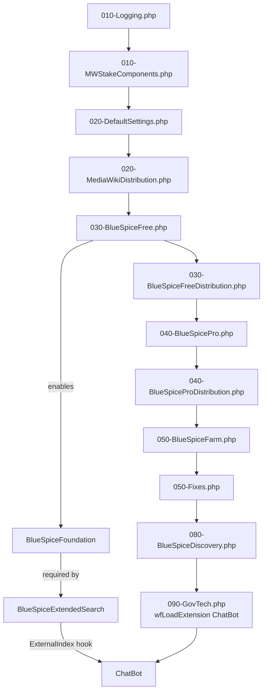

# Module: `settings.d/`

The `app/settings.d/` directory contains numbered PHP configuration files that are automatically loaded by `LocalSettings.BlueSpice.php` in ascending filename order. This mechanism controls which MediaWiki/BlueSpice extensions are enabled and in what order — defining the feature tiers (Free, Pro, Discovery) and the HDP-specific ChatBot.

## Responsibilities

- Enable ~130 MediaWiki extensions and skins via `wfLoadExtension()` / `wfLoadSkin()`
- Configure extension-specific settings (`$GLOBALS` overrides)
- Define permission roles and presets for BlueSpice's role-based access control
- Layer configuration in strict load order: core → MWStake → defaults → Free → Pro → Farm → Discovery → GovTech/ChatBot

## Key Files

Files are loaded in ascending numerical order (glob sorts alphabetically, so `010-` before `020-` before `030-`):

| File | Purpose |
|---|---|
| [`010-Logging.php`](../../app/settings.d/010-Logging.php) | Monolog logger configuration; sets up error/exception handlers |
| [`010-MWStakeComponents.php`](../../app/settings.d/010-MWStakeComponents.php) | Initializes MWStake component framework (must run before any extension instantiates `MediaWikiServices`) |
| [`020-DefaultSettings.php`](../../app/settings.d/020-DefaultSettings.php) | Core MediaWiki defaults: uploads, CSP, permissions, reserved users, group types |
| [`020-MediaWikiDistribution.php`](../../app/settings.d/020-MediaWikiDistribution.php) | Standard MediaWiki extensions (Cite, CodeEditor, etc.) |
| [`030-BlueSpiceFree.php`](../../app/settings.d/030-BlueSpiceFree.php) | BlueSpice Free tier extensions (~25 extensions: Foundation, ExtendedSearch, ConfigManager, etc.) |
| [`030-BlueSpiceFreeDistribution.php`](../../app/settings.d/030-BlueSpiceFreeDistribution.php) | Free tier distribution connector |
| [`040-BlueSpicePro.php`](../../app/settings.d/040-BlueSpicePro.php) | BlueSpice Pro tier extensions (~20 extensions: Bookshelf, Privacy, Rating, SMWConnector, etc.) |
| [`040-BlueSpiceProDistribution.php`](../../app/settings.d/040-BlueSpiceProDistribution.php) | Pro tier distribution: ~50 third-party extensions (SemanticMediaWiki, LDAP, OAuth, Workflows, PageForms, etc.) |
| [`050-BlueSpiceFarm.php`](../../app/settings.d/050-BlueSpiceFarm.php) | WikiFarm support (multi-instance) |
| [`050-Fixes.php`](../../app/settings.d/050-Fixes.php) | Session and content handler compatibility fixes |
| [`080-BlueSpiceDiscovery.php`](../../app/settings.d/080-BlueSpiceDiscovery.php) | BlueSpice Discovery skin (default skin) + footer/logo configuration |
| [`090-GovTech.php`](../../app/settings.d/090-GovTech.php) | **HDP-specific**: enables the ChatBot extension |

## Loading Mechanism

The auto-loader is in [`app/LocalSettings.BlueSpice.php`](../../app/LocalSettings.BlueSpice.php):

```php
$settingsDir = "$IP/settings.d";
foreach ( glob( $settingsDir . "/*.php" ) as $conffile ) {
    // Check for .local.php override (e.g., 030-BlueSpiceFree.local.php)
    $searchString = preg_replace( '/\.[^.\\s]{3,4}$/', '', $conffile ) . ".local.php";
    if ( file_exists( $searchString ) ) {
        $conffile = $searchString;  // local override takes precedence
    }
    require_once $conffile;
}
```

**Key behavior:** Each file is loaded once. If a `.local.php` variant exists (e.g., `030-BlueSpiceFree.local.php`), it replaces the base file — enabling per-environment overrides without modifying the original.

## Load Order & Dependency Graph



## Notable Patterns / Gotchas

- **Number prefix convention** — The `NNN-` prefix enforces load order. Changing a number changes when the file loads relative to others. Dependencies must load first (e.g., BlueSpiceFoundation in `030-` before ChatBot in `090-`).
- **`bsgPermissionConfig`** — Permission roles are configured throughout these files using the `$GLOBALS['bsgPermissionConfig']` array, mapping actions to BlueSpice role types (`reader`, `editor`, `admin`).
- **Permission preset** — `030-BlueSpiceFree.php` sets `$bsgPermissionManagerActivePreset = 'private'`, making the wiki private by default. `040-BlueSpicePro.php` unsets `$bsgOverridePermissionManagerAllowedPresets`, locking the preset.
- **Pro tier depends on Free tier** — `040-BlueSpicePro.php` loads extensions that depend on extensions loaded in `030-BlueSpiceFree.php` (e.g., BlueSpiceBookshelf needs BlueSpiceFoundation).
- **Discovery skin loaded late** — `080-BlueSpiceDiscovery.php` loads the skin after all extensions, as it needs to configure footer icons that reference extension assets.
- **ChatBot is last** — `090-GovTech.php` (just `wfLoadExtension('ChatBot')`) loads last because ChatBot hooks into BlueSpiceExtendedSearch's `ExternalIndexRegistry`, which must already be initialized.
