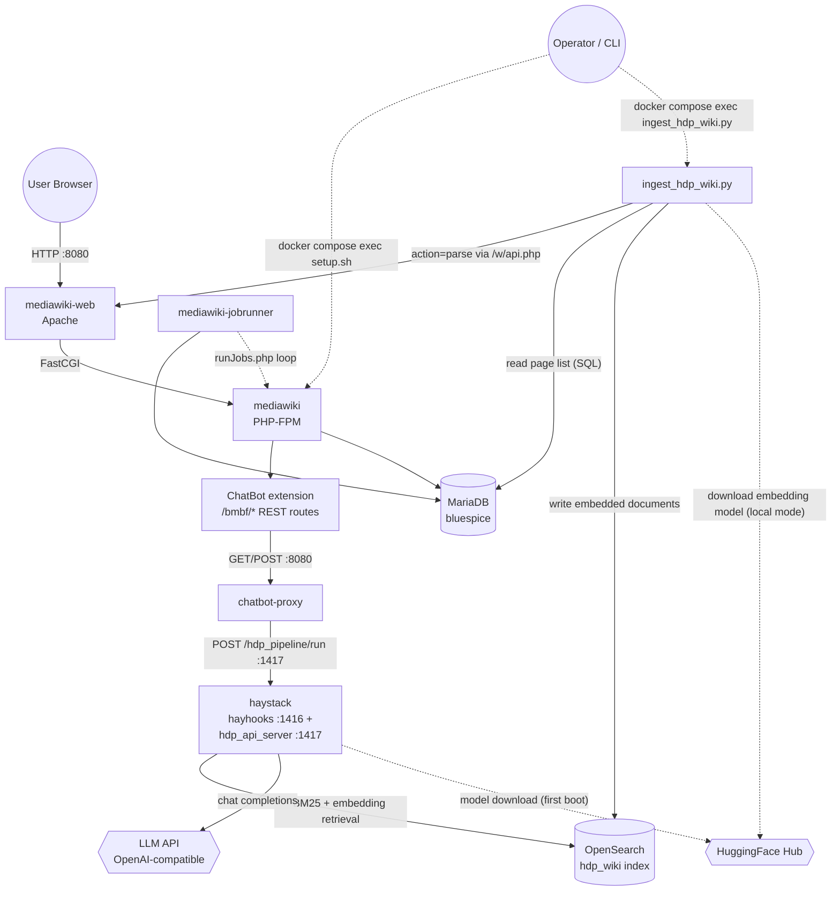

# Architecture

## System Shape

HDP is two systems wired together: a MediaWiki/BlueSpice wiki (the content
system of record) and a Haystack-based RAG chatbot (a read-only consumer of
that content). They share no code and only one narrow integration surface —
HTTP. The wiki never calls into the RAG stack directly; the **ChatBot**
MediaWiki extension exposes REST endpoints under `/bmbf/*` that a browser
chat widget calls, and those handlers proxy to **chatbot-proxy**, a small
translation shim that reshapes the extension's Deepset-Cloud-style API calls
into calls the Haystack container understands. The Haystack container itself
retrieves from **OpenSearch** and generates answers via an OpenAI-compatible
**LLM API** (defaults to `gpt-4o`, configurable to any compatible endpoint
via `HDP_LLM_BASE_URL`).

Data enters the wiki side normally — editors create/edit pages, stored in
**MariaDB** by MediaWiki. Data enters the *chatbot's* knowledge base through
a completely separate path: the standalone
[`ingest_hdp_wiki.py`](../../docker/haystack/ingest_hdp_wiki.py) script,
run manually (or on a schedule an operator sets up), logs into the
MediaWiki API, renders each page, splits it into sections, embeds the text,
and writes documents straight into OpenSearch's `hdp_wiki` index. The
ChatBot extension does ship its own built-in indexing pipeline
(`UpdateIndexTable` → `bmbf_index_pages` queue → `IndexDeepset` background
job every 5 minutes, targeting `BmbfDeepsetApiIndexUrl`), but in this
deployment that URL is configured empty (see
[settings-d](modules/settings-d.md)) — it is inert. `ingest_hdp_wiki.py` is
the only thing that actually populates the search index.

State lives in three places with three different lifecycles: MariaDB (wiki
content, durable, edited constantly), OpenSearch (a derived, rebuildable
index of wiki content, refreshed by re-running ingestion), and the
`haystack_models` Docker volume (a HuggingFace model cache, purely a
performance optimization — safe to delete and let re-download). Everything
else is stateless request/response.

## Components

- **mediawiki-web** — Apache reverse proxy, the only container with a
  published host port for the wiki (`${MW_DOCKER_PORT}`, default 8080).
- **mediawiki** — PHP-FPM application server running MediaWiki + ~130
  BlueSpice extensions + the ChatBot extension.
- **mediawiki-jobrunner** — continuously drains MediaWiki's job queue
  (notifications, search index maintenance, ChatBot's — inert — 5-minute
  indexing cycle).
- **mariadb** — the wiki's relational database.
- **opensearch** — full-text + vector search; backs both BlueSpice's native
  search and the RAG pipeline's `hdp_wiki` index.
- **chatbot-proxy** — stateless Python HTTP shim translating Deepset API
  shape ↔ Haystack API shape.
- **haystack** — runs the RAG pipeline two ways: `hayhooks` (port 1416,
  admin/deploy API) and a custom FastAPI wrapper, `hdp_api_server.py` (port
  1417, the actual query API `chatbot-proxy` and `ingest_hdp_wiki.py`'s
  callers use).
- **ingest_hdp_wiki.py** — not a long-running service; a script invoked via
  `docker compose exec haystack python3 ingest_hdp_wiki.py`.

## System Diagram

## Data Flow

1. **Authoring**: an editor writes/edits a page in the wiki UI → MediaWiki
   writes it to MariaDB.
2. **Ingestion (manual/scheduled, not automatic)**: an operator runs
   `ingest_hdp_wiki.py` → it queries MariaDB for indexable pages (namespaces
   `0`, `5000`, `5002`), calls MediaWiki's `action=parse` API for rendered
   HTML per page, splits by `<h1>`–`<h6>` headings into sections, embeds each
   section, and writes them to OpenSearch's `hdp_wiki` index
   (`DuplicatePolicy.OVERWRITE`, keyed by a hash of page ID + section name).
3. **Query**: a reader asks a question in the chat widget → `GET /bmbf/chat`
   on the MediaWiki REST API → `ChatApi::request()` opens an SSE connection
   to `chatbot-proxy` → `chatbot-proxy` calls the Haystack `hdp_api_server`
   → the pipeline reformulates the question, retrieves top documents from
   OpenSearch via BM25 *and* embedding similarity, re-ranks with a
   cross-encoder, and prompts the LLM to answer using only those documents,
   citing them as `[N]`.
4. **Response**: the answer streams back through the same chain as SSE —
   Haystack → `chatbot-proxy` (re-chunked into word-batches) → MediaWiki
   REST → the browser's chat widget, which renders `[N]` citations as
   clickable source links.

## Key Design Decisions

- **A proxy shim instead of forking the extension.** The ChatBot extension
  was originally built against Deepset Cloud's hosted API shape (session
  creation, `pipeline_id`, `search_session_id`, a specific SSE event
  format). Rather than modifying the extension's PHP, `chatbot-proxy`
  reproduces just enough of that shape in front of the self-hosted Haystack
  pipeline — see [chatbot-extension](modules/chatbot-extension.md) and
  [docker-services](modules/docker-services.md).
- **Ingestion is a script, not a live job.** The extension's own
  `IndexDeepset` background job (queue table + 5-minute cron-like handler)
  is left in place but pointed at an empty URL, and a separate Python
  script does the real indexing directly against OpenSearch. This keeps the
  RAG indexing logic (chunking, embedding, metadata shape) in one
  inspectable, dry-run-able, re-runnable place instead of split across PHP
  hooks and a job queue. The tradeoff: indexing is **not** automatic on
  page save — see [ingestion](modules/ingestion.md).
- **Two ports into the same pipeline logic.** `hayhooks` (1416) deploys and
  manages the pipeline (used for `POST /deploy-yaml` at container start);
  `hdp_api_server.py` (1417) independently loads the same
  `hdp_pipeline.yaml` via Haystack's Python `Pipeline.loads()` and exposes a
  numpy/Haystack-object-safe JSON wrapper around it. `chatbot-proxy` and the
  documented `curl` examples all target 1417, not the hayhooks-managed
  endpoint on 1416 — see [haystack-pipeline](modules/haystack-pipeline.md).
- **Embedding provider is a runtime switch, not a rebuild.** Because
  Haystack pipeline YAML declares component *types* statically,
  `render_pipeline.py` text-substitutes the `query_embedder` component
  block between sentinel comments before `hayhooks`/`hdp_api_server` ever
  parse the YAML, so `local` vs `remote` embedding is a `.env` change plus a
  container recreate, not a code change — see
  [embedding-providers](modules/embedding-providers.md).
- **Secrets are Infisical-first with a plaintext fallback.** Every
  container that needs a secret sources `infisical-loader.sh` at startup,
  which overwrites `.env`-provided values with Infisical-fetched ones if
  Infisical credentials are configured — otherwise it's a no-op and `.env`
  plaintext is used as-is.
