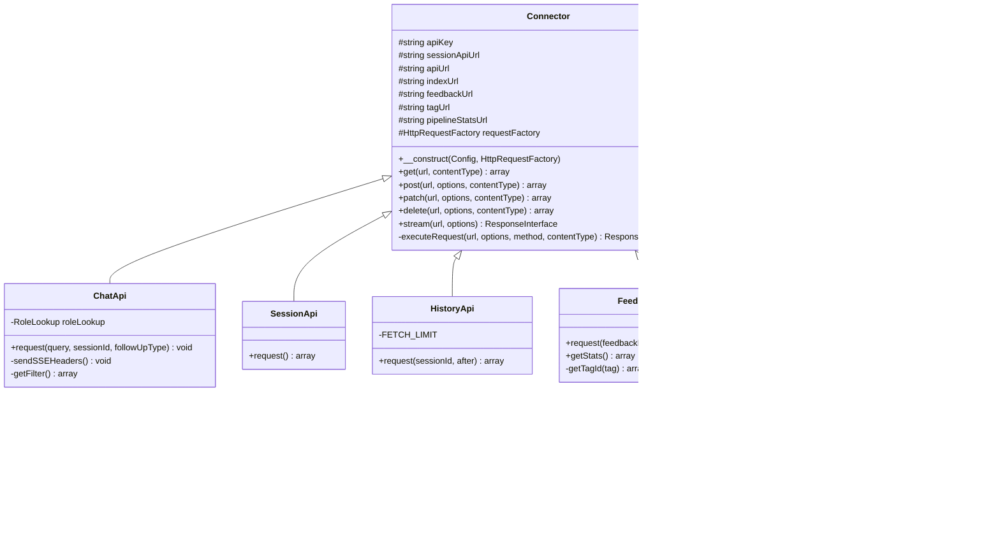

# Class Diagram

## Scope

Most of this codebase doesn't benefit from a class diagram: `app/` is ~130
largely-independent, mostly-configuration-driven BlueSpice extensions
(documented structurally in [settings-d](../modules/settings-d.md) instead,
since their relationships are *load order*, not inheritance), and the RAG
pipeline ([haystack-pipeline](../modules/haystack-pipeline.md)) is a
declarative YAML component graph, not an object hierarchy — its natural
diagram is the `flowchart` already in that module's doc. Force-fitting a
class diagram onto either would just restate the module docs in a worse
format.

One piece of this codebase *is* a genuine, useful class hierarchy: the
ChatBot extension's `DeepsetApi` HTTP client layer
([`app/extensions/ChatBot/src/DeepsetApi/`](../../../app/extensions/ChatBot/src/DeepsetApi)).
A single base class handles all outbound HTTP to `chatbot-proxy`, and six
purpose-specific subclasses each implement one REST use case. This is
worth diagramming because the shared base class is exactly what explains a
real gotcha: every subclass sends the same `Authorization: Bearer
{apiKey}` header and reads the same `BmbfDeepsetApi*` config, regardless of
which specific proxy endpoint it targets.

## `DeepsetApi` Client Hierarchy

## Notes

- Every subclass is wired via MediaWiki's DI container in
  [`includes/ServiceWiring.php`](../../../app/extensions/ChatBot/includes/ServiceWiring.php)
  (service names `DeepsetChatApi`, `DeepsetSessionApi`, `DeepsetHistoryApi`,
  `DeepsetFeedbackApi`, `DeepsetListApi`, `DeepsetIndexApi`), constructed
  with `MainConfig` + `HttpRequestFactory` (and, for `ChatApi`,
  `BmbfRoleLookup`; for `IndexApi`, `DeepsetListApi`) — not instantiated
  directly by callers.
- `ChatApi` is the only subclass whose `request()` writes directly to the
  HTTP response (`echo`/`ob_flush`/`flush`) rather than returning data —
  every other subclass returns an `array` (or `Status` for `IndexApi`,
  whose methods are also the only ones in this hierarchy actually invoked
  in this deployment's day-to-day chat flow that fail silently: they're
  called by the (inert here — see
  [chatbot-extension](../modules/chatbot-extension.md)) `IndexDeepset`
  background job against an empty `BmbfDeepsetApiIndexUrl`).
- `Connector::executeRequest()` is the single chokepoint for every outbound
  call in this hierarchy: it always sets a `Bearer {apiKey}` Authorization
  header (from `$wgBmbfDeepsetApiKey`, `"not-needed"` in this deployment,
  since `chatbot-proxy` doesn't check it) and a 120s timeout, via a
  freshly-constructed Guzzle `Client` per call.
