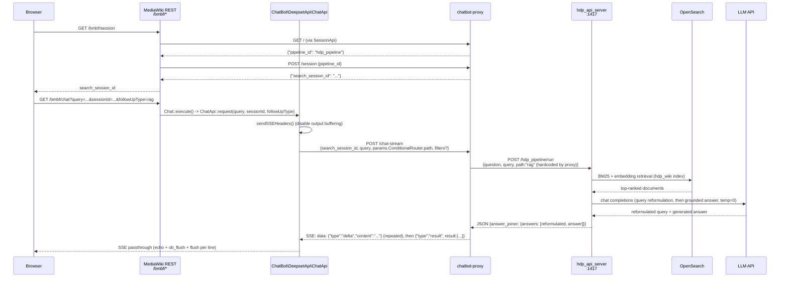
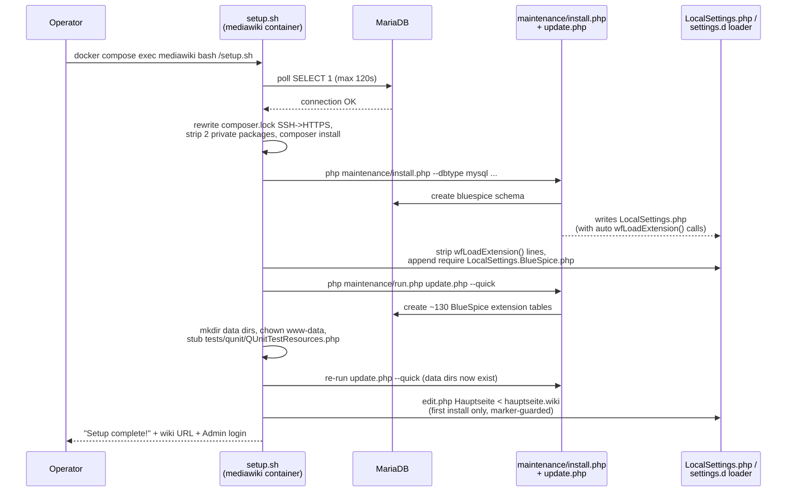

# Sequence Diagrams

Three key workflows, with real participants only (no invented services).
See [architecture.md](../architecture.md) for the system-level picture and
[modules/](../modules/) for per-component detail.

## (a) Chatbot Query



### Walkthrough

1. On chat widget open, the frontend calls `GET /bmbf/session`
   ([`src/Rest/Session.php`](../../../app/extensions/ChatBot/src/Rest/Session.php)),
   which invokes
   [`SessionApi::request()`](../../../app/extensions/ChatBot/src/DeepsetApi/SessionApi.php):
   first `GET` the configured `BmbfDeepsetApiChatUrl`
   (`http://chatbot-proxy:8080`) for a `pipeline_id`, then `POST` it to
   `BmbfDeepsetApiSearchSessionsUrl` (`.../session`) to get a
   `search_session_id`. Both are served by
   [`docker/chatbot-proxy/server.py`](../../../docker/chatbot-proxy/server.py)'s
   `do_GET`/`do_POST` handlers.
2. The user submits a question. The widget calls
   `GET /bmbf/chat?query=...&sessionId=...&followUpType=...`, routed by
   `extension.json` to
   [`src/Rest/Chat.php`](../../../app/extensions/ChatBot/src/Rest/Chat.php),
   which delegates to
   [`ChatApi::request()`](../../../app/extensions/ChatBot/src/DeepsetApi/ChatApi.php).
3. `ChatApi` disables PHP output buffering, sends SSE headers, and opens a
   **streaming** `POST` to `chatbot-proxy`'s `/chat-stream`, including a
   namespace-based access filter from `ChatApi::getFilter()` (see the
   gotcha in [chatbot-extension](../modules/chatbot-extension.md) — this
   filter is currently not read by the proxy).
4. `chatbot-proxy`'s `_handle_chat_stream()` reads only the `query` field
   and calls `call_hayhooks()`, which always sends `"path": "rag"` to
   `hdp_api_server`'s `POST /hdp_pipeline/run` — see
   [haystack-pipeline](../modules/haystack-pipeline.md).
5. The pipeline reformulates the query, retrieves + ranks documents from
   OpenSearch, and generates a grounded answer citing `[N]` documents (see
   the Pipeline Flow diagram in
   [haystack-pipeline](../modules/haystack-pipeline.md)).
6. `chatbot-proxy`'s `build_result_from_haystack()` reshapes the pipeline's
   response into a Deepset-shaped result, splits the answer into 5-word
   chunks, and streams them as `type:"delta"` SSE events, followed by one
   `type:"result"` event carrying the full answer + source documents.
7. `ChatApi::request()` reads the upstream SSE response line-by-line and
   echoes each line straight to the browser — no re-parsing — so the SSE
   event shape `chatbot-proxy` emits is exactly what the frontend
   (`resources/ts/utils/MessageParser.ts`) must understand.

## (b) Ingestion

```mermaid
sequenceDiagram
    participant Op as Operator
    participant Script as ingest_hdp_wiki.py
    participant DB as MariaDB
    participant MW as MediaWiki API<br>(mediawiki-web)
    participant Emb as Embedder<br>(local/remote/hf_space)
    participant OS as OpenSearch

    Op->>Script: docker compose exec haystack python3 ingest_hdp_wiki.py
    Script->>DB: SELECT page list<br>(namespaces 0, 5000, 5002; non-redirect)
    DB-->>Script: page rows
    Script->>MW: action=clientlogin (Admin)
    MW-->>Script: authenticated session
    loop for each page
        Script->>MW: action=parse (prefixed_title)
        MW-->>Script: rendered HTML, categories, properties
        Script->>Script: split_by_sections() -> Document objects
        Script->>Emb: embed_documents(documents)
        Emb-->>Script: documents with .embedding set
        Script->>OS: write_documents(policy=OVERWRITE)
    end
    Script-->>Op: log: total documents indexed + final count
```

### Walkthrough

1. An operator runs `ingest_hdp_wiki.py` inside the `haystack` container —
   see [ingestion](../modules/ingestion.md) and
   [getting-started.md](../getting-started.md) for the full CLI flag set
   (`--page`, `--dry-run`, `--missing-only`, `--provider`).
2. `get_namespace_pages()` queries MariaDB directly for indexable pages
   (main namespace `0`, `Ministerium` `5000`, `Projektträger` `5002`).
3. `mw_api_login()` authenticates to the MediaWiki API as `Admin` via
   `action=clientlogin`, auto-accepting any BlueSpice Privacy consent UI
   step it's presented with.
4. For each page, `render_page()` calls `action=parse` to get the same
   rendered HTML a reader would see, then `split_by_sections()` breaks it
   into heading-delimited chunks (falling back to a single "Full Page"
   chunk if there are no headings).
5. `process_page()` builds one Haystack `Document` per section (metadata
   shaped to match what the query pipeline's prompt/ranker expect — see
   [ingestion](../modules/ingestion.md)), embeds the batch via whichever
   embedder `make_embedder()` constructed (see
   [embedding-providers](../modules/embedding-providers.md)), and writes
   them to OpenSearch's `hdp_wiki` index with `DuplicatePolicy.OVERWRITE`.
6. A `0.2s` sleep between pages rate-limits the MediaWiki API calls. A
   single page's failure is logged and the run continues to the next page.

## (c) First-Boot Setup (`setup.sh`)



### Walkthrough

1. `setup.sh` waits up to 120s for MariaDB to accept a `SELECT 1` as the
   `bluespice` user — this is a real connectivity check, distinct from
   Docker's own MariaDB healthcheck (see the gotcha this addresses in
   `docs/QA-REPORT.md` Bug 7).
2. **Composer fix**: `hallowelt/chatbot` and `mediawiki/page-header` are
   pinned in `composer.lock` to a private GitLab and (for several other
   packages) SSH-form GitHub URLs. The script rewrites those to HTTPS,
   temporarily neutralizes `composer.local.json` (which declares the
   private VCS repos via the MWStake merge-plugin), strips the two private
   packages from the lockfile, and runs `composer install` — their actual
   source is already vendored under `app/extensions/`, so nothing is
   missing functionally.
3. **MediaWiki install**: `maintenance/install.php` is called directly
   (not via `run.php`, which would look in the wrong path) against
   MariaDB, generating a fresh `LocalSettings.php`. Its
   auto-`wfLoadExtension()` lines are then stripped and replaced with a
   `require_once "$IP/LocalSettings.BlueSpice.php"` — handing extension
   loading over to [settings.d](../modules/settings-d.md) instead, to
   avoid "extension loaded twice" fatals (e.g. `Echo`, loaded both natively
   and via a BlueSpice shim).
4. **`update.php`** runs twice: once immediately after install (creates
   most BlueSpice extension tables), and again after step 5 fixes
   permissions and creates data directories some extensions (e.g.
   SemanticMediaWiki) need to complete their own setup.
5. **Permission/stub fixes**: creates `extensions/BlueSpiceFoundation/data`
   and `extensions/SemanticMediaWiki/data`, `chown`s them plus
   `cache/`/`images/`/`tests/` to `www-data`, and stubs
   `tests/qunit/QUnitTestResources.php` (normally generated by Wikimedia
   dev tooling, not part of this repo — without it, every page load fatals
   under the Wikimedia dev image's ResourceLoader).
6. **Main page population** (first install only): replaces the generic
   upstream welcome page with
   [`docker/mediawiki/hauptseite.wiki`](../../../docker/mediawiki/hauptseite.wiki)
   via `maintenance/run.php edit.php`, guarded by a
   `cache/.hauptseite-populated` marker file so subsequent container
   restarts (or re-running `setup.sh`, which is idempotent) never overwrite
   an admin's later edits to the main page.
