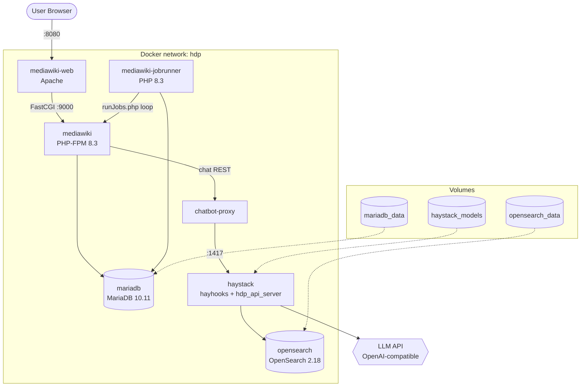

# Module: Docker Services

[`docker-compose.yml`](../../../docker-compose.yml) defines the entire HDP
deployment: 7 services, 3 named volumes, 1 bridge network. Supporting build
context and scripts live under [`docker/`](../../../docker).

## Responsibilities

- Orchestrate the wiki (MediaWiki PHP-FPM + Apache + job runner), its
  database (MariaDB), the search/vector store (OpenSearch), and the RAG
  stack (Haystack + chatbot-proxy).
- Build the Haystack image with CPU or GPU PyTorch via a build arg.
- Manage persistent volumes for the database, the search index, and the
  HuggingFace model cache.
- Load secrets from Infisical (if configured) or fall back to plaintext
  `.env`.

## Key Files

- [`docker-compose.yml`](../../../docker-compose.yml) — the compose file: 7 services, `mariadb_data`/`opensearch_data`/`haystack_models` volumes, `hdp` bridge network
- [`docker/setup.sh`](../../../docker/setup.sh) — first-boot install script, run manually inside the `mediawiki` container (see [getting-started.md](../getting-started.md))
- [`docker/infisical-loader.sh`](../../../docker/infisical-loader.sh) — sourced by `setup.sh` and the Haystack entrypoint; fetches `HDP_*`-prefixed secrets from Infisical
- [`docker/mariadb/sql-mode.cnf`](../../../docker/mariadb/sql-mode.cnf) — server-side SQL mode (superseded in practice by `$wgSQLMode` in [`050-Fixes.php`](../../../app/settings.d/050-Fixes.php), see [settings-d](settings-d.md))
- [`docker/mediawiki/hauptseite.wiki`](../../../docker/mediawiki/hauptseite.wiki) — custom main-page wikitext installed by `setup.sh`
- [`docker/wiki/www.conf`](../../../docker/wiki/www.conf) — PHP-FPM pool config (user/group, worker counts, `clear_env=no` so container env vars reach PHP)
- [`docker/chatbot-proxy/`](../../../docker/chatbot-proxy) — see [chatbot-extension](chatbot-extension.md) and [haystack-pipeline](haystack-pipeline.md)
- [`docker/haystack/`](../../../docker/haystack) — see [haystack-pipeline](haystack-pipeline.md) and [ingestion](ingestion.md)
- [`.env.example`](../../../.env.example) — the full commented variable reference

## Service Topology

## Service Details

### mariadb
- **Image:** `mariadb:10.11`
- **Role:** the `bluespice` database — pages, revisions, users, all
  BlueSpice extension tables
- **Health check:** `healthcheck.sh --connect --innodb_initialized` (falls
  back to `mysqladmin ping`)
- **Volume:** `mariadb_data:/var/lib/mysql`

### mediawiki (PHP-FPM)
- **Image:** `docker-registry.wikimedia.org/dev/bookworm-php83-fpm:1.0.0`
- **Volumes:** `./app:/var/www/html/w` (bind mount, shared with `mediawiki-web` and `mediawiki-jobrunner`), plus `docker/wiki/www.conf`, `docker/setup.sh`, `docker/mediawiki/hauptseite.wiki`, `docker/infisical-loader.sh` mounted read-only
- **Depends on:** `mariadb` (healthy), `opensearch` (healthy)
- **Health check:** TCP connect to `127.0.0.1:9000` (FastCGI has no HTTP endpoint of its own)

### mediawiki-web (Apache)
- **Image:** `docker-registry.wikimedia.org/dev/bookworm-apache2:1.0.1`
- **Ports:** `${MW_DOCKER_PORT:-8080}:8080` — the only host-published wiki port
- **Health check:** `curl http://localhost:${MW_DOCKER_PORT}/w/`

### mediawiki-jobrunner
- **Image:** `docker-registry.wikimedia.org/dev/bookworm-php83-jobrunner:1.0.0`
- **Role:** continuously drains MediaWiki's job queue (search index updates, notifications, and the ChatBot extension's — inert in this deployment, see [architecture.md](../architecture.md) — 5-minute indexing job)
- **Health check:** confirms the entrypoint's bash process is still PID 1 (no HTTP endpoint)

### opensearch
- **Image:** `opensearchproject/opensearch:2.18.0`
- **Config:** single-node, `bootstrap.memory_lock=false`, 512MB JVM heap (`-Xms512m -Xmx512m`)
- **Auth:** `admin` / `HDP_OPENSEARCH_PASSWORD` (set via `OPENSEARCH_INITIAL_ADMIN_PASSWORD`)
- **Indices:** `hdp_wiki` (RAG documents, written by [ingestion](ingestion.md)) plus BlueSpice's own ExtendedSearch indices
- **Volume:** `opensearch_data:/usr/share/opensearch/data`

### haystack
- **Build:** [`docker/haystack/Dockerfile`](../../../docker/haystack/Dockerfile) — multi-stage: `python:3.11-slim-bookworm` base, `HAYSTACK_DEVICE` build arg selects CPU-only or CUDA PyTorch, then installs `haystack-ai==2.15.0`, `hayhooks==1.10.0`, `opensearch-haystack`, `sentence-transformers`, etc.
- **Ports:** `${HAYHOOKS_PORT:-1416}:1416` (hayhooks admin/deploy API), `${HDP_PDF_PORT:-1417}:1417` (the actual query API used by `chatbot-proxy` — see [haystack-pipeline](haystack-pipeline.md) for why there are two ports)
- **Volume:** `haystack_models:/root/.cache/huggingface` — persists downloaded embedding/ranker models across restarts
- **Depends on:** `opensearch` (healthy)
- **Health check:** `curl http://localhost:1417/health`, with a generous 90s `start_period` since cold start downloads models and deploys the pipeline

### chatbot-proxy
- **Build:** [`docker/chatbot-proxy/Dockerfile`](../../../docker/chatbot-proxy/Dockerfile) — `python:3.12-slim`, stdlib-only `server.py` (no dependencies)
- **Role:** translates the ChatBot extension's Deepset-Cloud-shaped requests into calls against `haystack:1417` — see [chatbot-extension](chatbot-extension.md)
- **Depends on:** `haystack`
- **Health check:** a Python one-liner `urllib.request.urlopen` against `/`

## Notable Patterns / Gotchas

- **Shared bind mount** — All three MediaWiki containers (FPM, web,
  jobrunner) mount `./app` at `/var/www/html/w`. Code changes under `app/`
  are visible to all three without rebuilding images; `LocalSettings.php`
  and `app/vendor/` are generated/modified in-place by `setup.sh` inside
  this shared mount.
- **`MW_DOCKER_UID`/`MW_DOCKER_GID`** — the `mediawiki` (FPM master)
  container defaults to running as root (UID 0) so it can spawn `www-data`
  FPM workers per [`docker/wiki/www.conf`](../../../docker/wiki/www.conf);
  `mediawiki-web` and `mediawiki-jobrunner` default to `33:33` (`www-data`).
- **Two ports on `haystack`** — 1416 is `hayhooks`' own admin/deploy API
  (used once at container start to `POST /deploy-yaml`); 1417 is a separate
  custom FastAPI process (`hdp_api_server.py`) that independently loads the
  same pipeline YAML. `chatbot-proxy`'s `HAYHOOKS_URL` env var, despite the
  name, points at port **1417**. See [haystack-pipeline](haystack-pipeline.md).
- **Memory limits are all overridable** — every service's `deploy.resources.limits.memory`
  reads an `HDP_*_MEM_LIMIT` env var with a sensible default; bump these in
  `.env` if a container gets OOM-killed on a constrained host.
- **Infisical shadows `.env`** — `infisical-loader.sh` fetches *every*
  secret prefixed `HDP_` from Infisical and exports it, overriding whatever
  was passed via `.env`/`environment:` — including non-secret config like
  `HDP_LLM_MODEL` if it happens to also exist as an Infisical secret. See
  the Troubleshooting section of [README-DOCKER.md](../../../README-DOCKER.md).
- **`restart: unless-stopped` isn't a supervisor everywhere** — on some
  nested/sandboxed Docker hosts the documented restart policy doesn't
  actually fire after an OOM kill; see the last Troubleshooting entry in
  [README-DOCKER.md](../../../README-DOCKER.md).
