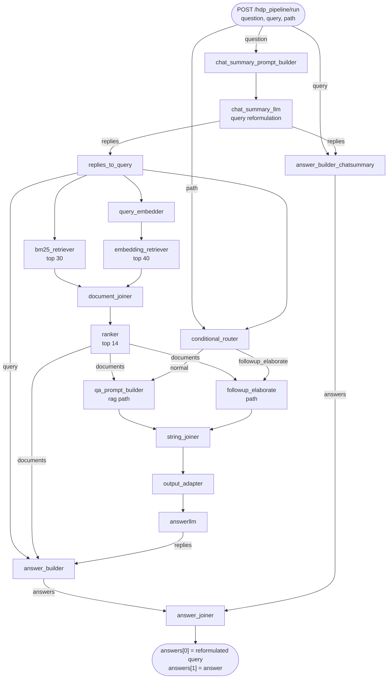

# Module: Haystack RAG Pipeline

The RAG query pipeline lives in
[`docker/haystack/`](../../../docker/haystack) and runs inside the
`haystack` container. It's a [Haystack](https://haystack.deepset.ai/) 2.x
pipeline, defined declaratively in YAML, that does query reformulation →
hybrid retrieval → cross-encoder ranking → grounded LLM answer generation.
It is exposed through **two separate HTTP servers in the same container** —
this is the module's single most important gotcha, see below.

## Responsibilities

- **Query reformulation** — rewrite the (possibly chat-history-carrying)
  question into a search-friendly form via an LLM call.
- **Hybrid retrieval** — parallel BM25 (`bm25_retriever`, top 30) and
  embedding similarity (`embedding_retriever`, top 40) search against
  OpenSearch, merged by `document_joiner`.
- **Cross-encoder ranking** — re-rank the merged set down to the top 14 with
  a cross-lingual EN-DE cross-encoder similarity model.
- **Multi-mode generation** — a `conditional_router` selects between answer
  styles based on a `path` input.
- **Grounded answer generation** — a strict German prompt instructing the
  LLM to answer only from the provided documents, cite them as `[N]`, and
  say so if no answer is found.

## Key Files

- [`docker/haystack/hdp_pipeline.yaml`](../../../docker/haystack/hdp_pipeline.yaml) — the pipeline definition (components + connections + inputs/outputs), deployed by hayhooks
- [`docker/haystack/render_pipeline.py`](../../../docker/haystack/render_pipeline.py) — rewrites the `query_embedder` component block in the YAML at container start based on `HDP_EMBEDDING_PROVIDER`
- [`docker/haystack/hdp_api_server.py`](../../../docker/haystack/hdp_api_server.py) — a custom FastAPI wrapper that loads the pipeline directly and exposes `POST /hdp_pipeline/run` on port **1417** (this, not hayhooks, is what `chatbot-proxy` actually calls)
- [`docker/haystack/entrypoint.sh`](../../../docker/haystack/entrypoint.sh) — container startup: Infisical secrets → wait for OpenSearch → pre-download models → render embedder block → start hayhooks (1416) → deploy pipeline via `POST /deploy-yaml` → start `hdp_api_server.py` (1417)
- [`docker/haystack/Dockerfile`](../../../docker/haystack/Dockerfile) — multi-stage build; `HAYSTACK_DEVICE` build arg (`cpu`/`gpu`) selects the PyTorch variant
- [`pipeline/haystack-pipeline.py`](../../../pipeline/haystack-pipeline.py) — a standalone Python (not YAML) build of an equivalent pipeline, kept for local testing/reference; **not** what the `haystack` container runs

## Pipeline Components

| Component | Type | Purpose |
|---|---|---|
| `chat_summary_prompt_builder` | `PromptBuilder` | Builds the reformulation prompt from chat history |
| `chat_summary_llm` | `OpenAIGenerator` | Reformulates the query (temp=0), any OpenAI-compatible endpoint via `HDP_LLM_BASE_URL` |
| `replies_to_query` | `OutputAdapter` | Extracts the reformulated query string from the LLM reply |
| `bm25_retriever` | `OpenSearchBM25Retriever` | Lexical search against `hdp_wiki`, top 30 |
| `query_embedder` | `SentenceTransformersTextEmbedder` (local) or `OpenAITextEmbedder` (remote) | Embeds the query — swapped by `render_pipeline.py`, see [embedding-providers](embedding-providers.md) |
| `embedding_retriever` | `OpenSearchEmbeddingRetriever` | Dense search against `hdp_wiki`, top 40, `efficient_filtering: true` |
| `document_joiner` | `DocumentJoiner` (`concatenate`) | Merges BM25 + embedding hits |
| `ranker` | `SentenceTransformersSimilarityRanker` | Cross-encoder re-rank with `cross-encoder/msmarco-MiniLM-L6-en-de-v1`, top 14 |
| `conditional_router` | `ConditionalRouter` | Six routes on `path` (`rag`, `followup_*`), but only `rag`/`normal` and `followup_elaborate` connect to an actual `PromptBuilder` |
| `qa_prompt_builder` | `PromptBuilder` | The default grounded-answer prompt (`rag` path) |
| `followup_elaborate` | `PromptBuilder` | Same prompt template, wired for the `followup_elaborate` path |
| `string_joiner` / `output_adapter` | Joiners | Collapse whichever prompt builder fired into a single string |
| `answerllm` | `OpenAIGenerator` | Generates the final answer (temp=0) |
| `answer_builder` / `answer_builder_chatsummary` / `answer_joiner` | `AnswerBuilder`/`AnswerJoiner` | Package the reformulated query and the real answer into a two-element `answers` list |

## ML Models Used

| Model | Role | Notes |
|---|---|---|
| `mixedbread-ai/deepset-mxbai-embed-de-large-v1` (default) | Query + document embedding (German) | Configurable via `HDP_EMBEDDING_MODEL`; dimension via `HDP_EMBEDDING_DIM` (default 1024) |
| `cross-encoder/msmarco-MiniLM-L6-en-de-v1` | Cross-encoder re-ranking (EN-DE cross-lingual) | Hardcoded in `hdp_pipeline.yaml`, always downloaded locally regardless of embedding provider |
| Whatever `HDP_LLM_MODEL` points to (default `gpt-4o`) | Query reformulation + answer generation | Any OpenAI-compatible chat completions endpoint via `HDP_LLM_BASE_URL` |

## Answer Modes (`conditional_router` paths)

| Path | Description | Actually reachable via chatbot-proxy? |
|---|---|---|
| `rag` | Default — detailed grounded answer | Yes — the only path `chatbot-proxy` ever sends, see [chatbot-extension](chatbot-extension.md) |
| `followup_short`, `followup_bulletpoints`, `followup_onlytext`, `followup_citations` | Declared as router outputs (and in `ChatApi`'s docblock) | Not wired to a `PromptBuilder` in `hdp_pipeline.yaml` at all |
| `followup_elaborate` | Same prompt template as `rag`, separate router branch | Wired in the pipeline, but unreachable via `chatbot-proxy` today (hardcodes `path: "rag"`) |

## Two Ports, Two Ways to Run the Same Pipeline

`entrypoint.sh` starts **both**:

1. **hayhooks on port 1416** — the general-purpose Haystack pipeline server.
   The entrypoint deploys `hdp_pipeline.yaml` to it via
   `POST /deploy-yaml` at container start. It also serves `/docs` (used by
   the entrypoint's own readiness check).
2. **`hdp_api_server.py` on port 1417** — a small custom FastAPI app that
   independently calls `Pipeline.loads()` on the same (`envsubst`-rendered)
   YAML at import time, and exposes `POST /hdp_pipeline/run` /
   `GET /health`. It converts Haystack's `Document`/`Answer` objects and any
   `numpy` types in the result into plain JSON (`to_native()`), which the
   raw hayhooks response would not otherwise guarantee.

`chatbot-proxy` and the `README-DOCKER.md`-documented `curl` examples both
target **1417**. Port 1416 exists for pipeline deployment/administration,
not as the query path this deployment actually uses.

## Pipeline Flow

## Environment Variables

| Variable | Default | Description |
|---|---|---|
| `OPENSEARCH_HOST` / `OPENSEARCH_PORT` | `opensearch` / `9200` | OpenSearch connection |
| `OPENSEARCH_PASSWORD` | — | OpenSearch `admin` password |
| `HDP_LLM_BASE_URL` / `HDP_LLM_MODEL` / `HDP_LLM_API_KEY` | `https://open.bigmodel.cn/api/paas/v4` / `glm-4.7` (compose defaults; `.env.example` recommends `https://api.openai.com/v1` / `gpt-4o`) | LLM endpoint used by both `chat_summary_llm` and `answerllm` |
| `HDP_EMBEDDING_PROVIDER` | `local` | `local` \| `remote` — see [embedding-providers](embedding-providers.md) |
| `HDP_EMBEDDING_MODEL` / `HDP_EMBEDDING_DIM` | `mixedbread-ai/deepset-mxbai-embed-de-large-v1` / `1024` | Embedding model + vector dimension |
| `HAYHOOKS_PORT` | `1416` | hayhooks admin/deploy port |
| `HAYSTACK_DEVICE` | `cpu` | `cpu` or `gpu` PyTorch build |

## Dependencies

- `haystack-ai==2.15.0`, `haystack-experimental==0.19.0.post1`,
  `hayhooks==1.10.0`, `opensearch-haystack==5.1.0`,
  `sentence-transformers==5.6.1`, `transformers==5.14.1`,
  `accelerate==1.14.0`, `pymysql==1.2.0`, `gradio_client` (pinned in
  [`docker/haystack/Dockerfile`](../../../docker/haystack/Dockerfile))
- **Upstream:** OpenSearch (retrieval), an OpenAI-compatible LLM API
  (generation), optionally HuggingFace Hub (model downloads)
- **Downstream:** `chatbot-proxy` (the only in-repo caller of port 1417)

## Notable Patterns / Gotchas

- **`chatbot-proxy` hardcodes `path: "rag"`.** Regardless of what
  `followUpType`/`path` the ChatBot extension sends, `chatbot-proxy`'s
  `call_hayhooks()` always requests the `rag` answer mode — see
  [chatbot-extension](chatbot-extension.md#notable-patterns--gotchas).
- **`filters` are not forwarded either.** `chatbot-proxy` only reads
  `body["query"]` from the incoming request; the ChatBot extension's
  namespace access-control filter never reaches the pipeline in this
  deployment.
- **SSL verification is disabled** on the OpenSearch connection
  (`verify_certs: false`, both retrievers) because the OpenSearch container
  runs with a self-signed certificate — acceptable only because it's
  reachable exclusively on the internal `hdp` Docker network.
- **`answers` is a two-element list, not one answer.** `answer_joiner`
  combines `answer_builder_chatsummary`'s answer (the reformulated query,
  `answers[0]`) with `answer_builder`'s answer (the real generated answer,
  `answers[1]`) — both `chatbot-proxy` and `hdp_api_server.py`'s callers
  need to know to take the *last* element, not the first.
- **Model pre-download happens at container start**, not lazily, to avoid a
  slow/timing-out first user query — skipped for the embedding model when
  `HDP_EMBEDDING_PROVIDER=remote` (no local model), but the cross-encoder
  ranker is always pre-downloaded regardless of embedding provider.
- **LLM timeout is 300s.** Both `OpenAIGenerator` components set
  `timeout: 300` — reasoning-heavy models can take 1-2 minutes to answer
  with 14 documents in context; see the Troubleshooting section of
  [README-DOCKER.md](../../../README-DOCKER.md).
- **Temperature 0** on both LLM calls, for reproducible outputs.
