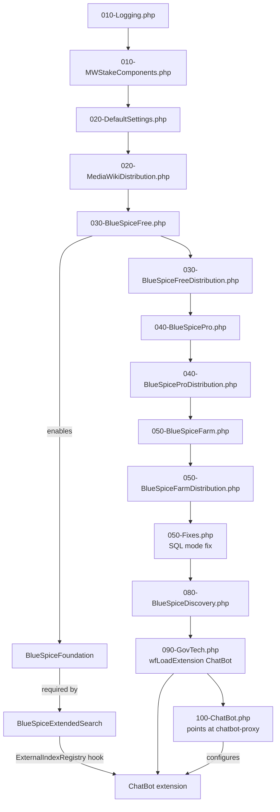

# Module: `settings.d/`

[`app/settings.d/`](../../../app/settings.d) contains numbered PHP
configuration files, auto-loaded in ascending filename order by
[`app/LocalSettings.BlueSpice.php`](../../../app/LocalSettings.BlueSpice.php),
which `setup.sh` appends a `require_once` for at the end of the generated
`LocalSettings.php`. This mechanism enables ~130 BlueSpice extensions in a
specific order with their configuration, and is where this fork's two
critical infrastructure fixes and the ChatBot→`chatbot-proxy` wiring live.

## Responsibilities

- Enable MediaWiki/BlueSpice extensions and skins (`wfLoadExtension()` /
  `wfLoadSkin()`) in dependency order.
- Configure extension-specific settings (`$GLOBALS` overrides).
- Layer configuration in tiers: core → MWStake → MediaWiki defaults → Free →
  Pro → Farm → fixes → Discovery skin → GovTech (ChatBot) → ChatBot config.

## Key Files

Loaded in this exact order (PHP's `glob()` returns results sorted
alphabetically, so the numeric prefix controls load order):

| File | Purpose |
|---|---|
| [`010-Logging.php`](../../../app/settings.d/010-Logging.php) | Monolog logger configuration |
| [`010-MWStakeComponents.php`](../../../app/settings.d/010-MWStakeComponents.php) | Initializes the MWStake component framework |
| [`020-DefaultSettings.php`](../../../app/settings.d/020-DefaultSettings.php) | Core MediaWiki defaults (uploads, CSP, permissions, reserved usernames) |
| [`020-MediaWikiDistribution.php`](../../../app/settings.d/020-MediaWikiDistribution.php) | Standard MediaWiki extensions |
| [`030-BlueSpiceFree.php`](../../../app/settings.d/030-BlueSpiceFree.php) | BlueSpice Free tier extensions |
| [`030-BlueSpiceFreeDistribution.php`](../../../app/settings.d/030-BlueSpiceFreeDistribution.php) | Free tier distribution connector |
| [`040-BlueSpicePro.php`](../../../app/settings.d/040-BlueSpicePro.php) | BlueSpice Pro tier extensions |
| [`040-BlueSpiceProDistribution.php`](../../../app/settings.d/040-BlueSpiceProDistribution.php) | Pro tier: third-party extensions (SemanticMediaWiki, LDAP, OAuth, PageForms, etc.) |
| [`050-BlueSpiceFarm.php`](../../../app/settings.d/050-BlueSpiceFarm.php) | WikiFarm (multi-instance) support |
| [`050-BlueSpiceFarmDistribution.php`](../../../app/settings.d/050-BlueSpiceFarmDistribution.php) | WikiFarm distribution connector |
| [`050-Fixes.php`](../../../app/settings.d/050-Fixes.php) | **This fork's fixes**: session expiry, legacy content-model fallback, and the `$wgSQLMode` `ONLY_FULL_GROUP_BY` fix |
| [`080-BlueSpiceDiscovery.php`](../../../app/settings.d/080-BlueSpiceDiscovery.php) | BlueSpice Discovery skin (default) + footer/logo config |
| [`090-GovTech.php`](../../../app/settings.d/090-GovTech.php) | **HDP-specific**: `wfLoadExtension('ChatBot')` — 3 lines, nothing else |
| [`100-ChatBot.php`](../../../app/settings.d/100-ChatBot.php) | **This fork's fix**: points the ChatBot extension at `chatbot-proxy` instead of Deepset Cloud |

## Loading Mechanism

[`app/LocalSettings.BlueSpice.php`](../../../app/LocalSettings.BlueSpice.php):

```php
$settingsDir = "$IP/settings.d";
foreach ( glob( $settingsDir . "/*.php" ) as $conffile ) {
    $searchString = preg_replace( '/\.[^.\s]{3,4}$/', '', $conffile ) . ".local.php";
    if ( file_exists( $searchString ) ) {
        $conffile = $searchString;   // e.g. 100-ChatBot.local.php overrides 100-ChatBot.php
    }
    if ( !in_array( $conffile, $loaded ) ) {
        require_once $conffile;
    }
}
```

A `NNN-Name.local.php` file next to any `NNN-Name.php` is loaded *instead*
of the base file — an environment-specific override mechanism, unused by
default in this repo.

## Load Order & Dependency Graph



## Notable Patterns / Gotchas

- **`config_prefix` matters.** `app/extensions/ChatBot/extension.json`
  declares no `config_prefix`, so MediaWiki's default `GlobalVarConfig`
  reads **`wg`-prefixed** globals for this extension's config
  (`$config->get('BmbfDeepsetApiChatUrl')` reads
  `$GLOBALS['wgBmbfDeepsetApiChatUrl']`, not
  `$GLOBALS['BmbfDeepsetApiChatUrl']`). `100-ChatBot.php` sets the
  `wg`-prefixed names explicitly, with a comment recording that this was
  previously a silent no-op bug (unprefixed globals set, extension reading
  `wg`-prefixed ones and always getting the `extension.json` default `""`)
  — see `docs/QA-REPORT.md` Bug 5. This is exactly the gotcha described in
  [chatbot-extension](chatbot-extension.md#configuration-wg-prefixed-mediawiki-globals).
- **`$wgSQLMode` beats the MariaDB server config.** The Wikimedia dev
  image's `PlatformSettings.php` (required before `settings.d/` loads) sets
  `$wgSQLMode = 'STRICT_ALL_TABLES,ONLY_FULL_GROUP_BY'`. Because MediaWiki's
  DB layer applies `$wgSQLMode` on every connection, fixing only the
  server-side `sql_mode` (`docker/mariadb/sql-mode.cnf`) is not enough —
  `050-Fixes.php` strips `ONLY_FULL_GROUP_BY` from `$wgSQLMode` itself,
  *after* `PlatformSettings.php` has already run, which is the layer that
  actually wins.
- **Number prefix is a hard dependency order, not just a display order.**
  `090-GovTech.php` loads `ChatBot` after `030-`/`040-` have already
  enabled `BlueSpiceFoundation` and `BlueSpiceExtendedSearch`, because
  `ChatBot`'s `extension.json` registers into
  `BlueSpiceExtendedSearch`'s `ExternalIndexRegistry` attribute at
  registration time.
- **`100-ChatBot.php` is the newest file (highest number)**, added by this
  fork specifically to override the four `BmbfDeepsetApi*` URLs after
  `090-GovTech.php` has loaded the extension — config files can safely load
  after the extension that reads them, since MediaWiki only evaluates
  `$config->get()` at request time, not at extension-registration time.
- **`090-GovTech.php` is intentionally tiny** — 3 lines, just
  `wfLoadExtension('ChatBot')`. All actual ChatBot configuration lives in
  the separate `100-ChatBot.php`, keeping "load the extension" and
  "configure it for this deployment" as distinct, independently-overridable
  files.
